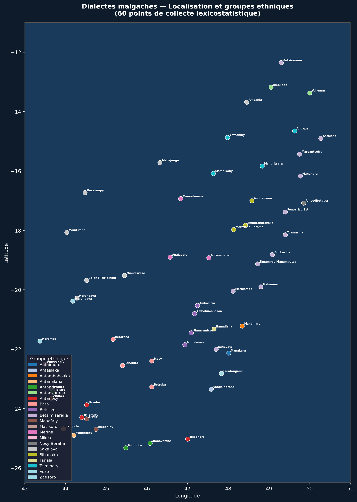
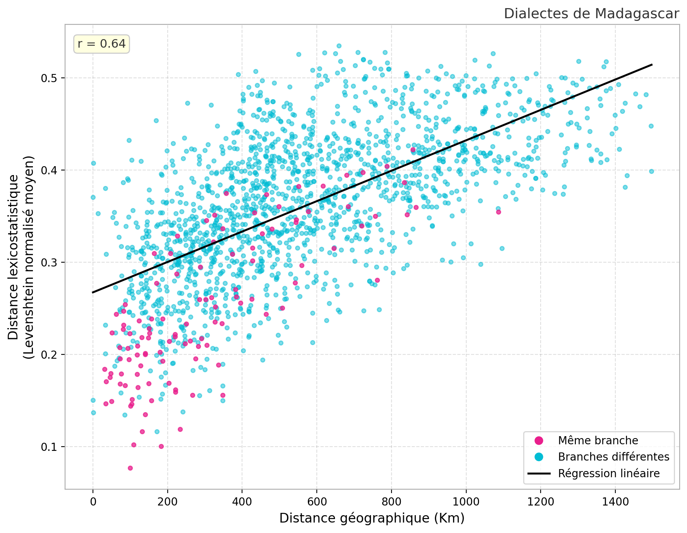
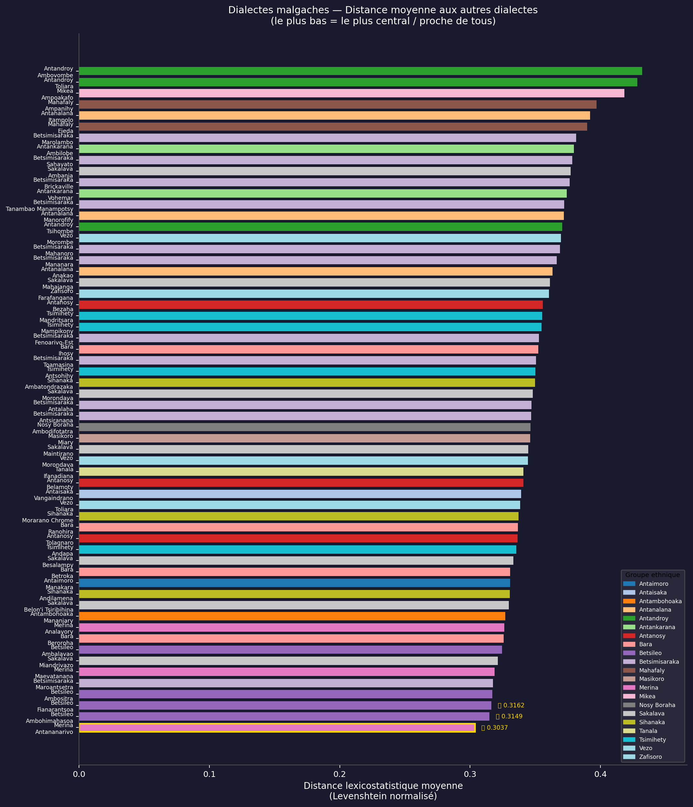
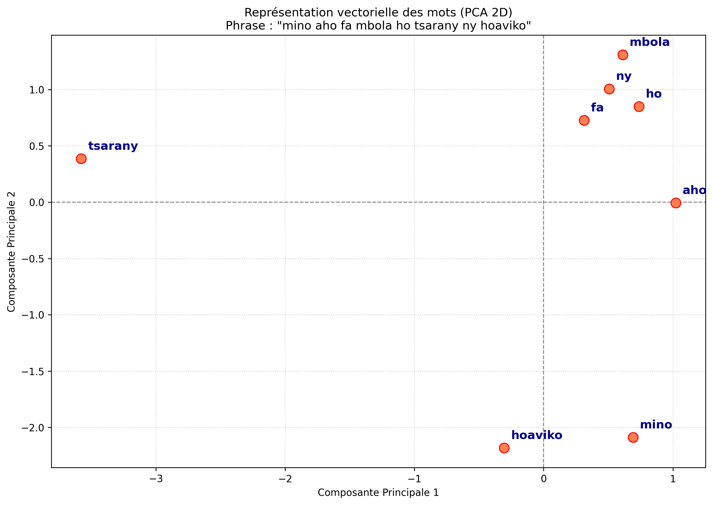

# 🇲🇬 BOLOKY — Écosystème de Traduction Vocale Multidirectionnelle et Traitement des Dialectes Malgaches

---

## 🎥 Démonstration Vidéo

<!-- EMPLACEMENT VIDÉO DE DÉMONSTRATION -->
<div align="center">

[](https://www.youtube.com/watch?v=VOTRE_ID_VIDEO)

> 📹 **Lien de la vidéo démo :** `[Insérer ici le lien YouTube / Google Drive / Loom de la démo vidéo]`  
> *(Remplacez l'URL ci-dessus par le lien final de votre démonstration)*

</div>

---

## 📑 Table des Matières
1. [Vue d'Ensemble & Emplacement des Composants](#-vue-densemble--emplacement-des-composants)
2. [Cadre Scientifique & Analyse Lexicostatistique des Dialectes](#-cadre-scientifique--analyse-lexicostatistique-des-dialectes)
   - [1. Cartographie Géolinguistique (60 points de collecte)](#1-cartographie-géolinguistique-60-points-de-collecte)
   - [2. Corrélation Distance Géographique vs Distance Lexicale](#2-corrélation-distance-géographique-vs-distance-lexicale)
   - [3. Hiérarchie de Centralité & Intercompréhension](#3-hiérarchie-de-centralité--intercompréhension)
3. [Création du Tokenizer Dédié & Morphologie Malgache](#-création-du-tokenizer-dédié--morphologie-malgache)
   - [Algorithme SentencePiece Unigram & Hyperparamètres](#1-algorithme-sentencepiece-unigram--hyperparamètres)
   - [Gestion Morphologique et Caractères Spéciaux](#2-gestion-morphologique-et-caractères-spéciaux)
   - [Visualisation du Tokenizer & Token Cloud](#3-visualisation-du-tokenizer--token-cloud)
4. [Espace d'Embedding & Représentation Vectorielle](#-espace-dembedding--représentation-vectorielle)
   - [Entraînement FastText & Word2Vec](#1-entraînement-fasttext--word2vec)
   - [Visualisation PCA 2D des Projections Vectorielles](#2-visualisation-pca-2d-des-projections-vectorielles)
   - [Évaluation Sémantique et Analogies Linguistiques](#3-évaluation-sémantique-et-analogies-linguistiques)
5. [Acquisition de Données, Traitement & Alignement des Patterns](#-acquisition-de-données-traitement--alignement-des-patterns)
   - [Traitement des Données & Éditeur Dédié (EditeurMalagasy)](#1-traitement-des-données--éditeur-dédié-editeurmalagasy)
   - [Génération par Alignement de Patterns Linguistiques & Révision Humaine](#2-génération-par-alignement-de-patterns-linguistiques--révision-humaine)
6. [Modèles de Traduction Automatique (NMT)](#-modèles-de-traduction-automatique-nmt)
   - [Architecture Transformer Seq2Seq](#1-architecture-transformer-seq2seq)
   - [Traduction Multilingue Hautes Ressources](#2-traduction-multilingue-hautes-ressources)
   - [Méthodologie d'Entraînement & Optimisation](#3-méthodologie-dentraînement--optimisation)
7. [Synthèse Vocale (TTS) & Reconnaissance Vocale (STT)](#-synthèse-vocale-tts--reconnaissance-vocale-stt)
   - [Synthèse Vocale Dialectale (Modèle VITS)](#1-synthèse-vocale-dialectale-modèle-vits)
   - [Post-traitement Audio Numérique (DSP)](#2-post-traitement-audio-numérique-dsp)
   - [Synthèse Vocale Multilingue](#3-synthèse-vocale-multilingue)
   - [Reconnaissance Vocale (STT)](#4-reconnaissance-vocale-stt)
8. [Architecture Logicielle & Déploiement](#-architecture-logicielle--déploiement)
9. [Structure du Dépôt](#-structure-du-dépôt)
10. [Guide de Démarrage](#-guide-de-démarrage)
11. [Conclusion](#-conclusion)

---

## 🧭 Vue d'Ensemble & Emplacement des Composants

L'écosystème **BOLOKY** s'articule autour des modules et dépôts sources suivants :

| Composant | Emplacement / Dépôt | Rôle & Fonctionnalité |
| :--- | :--- | :--- |
| **Backend API** | `/home/tovo/Bureau/crappingSianaka/backend` | Serveur FastAPI orchestrant l'inférence NMT, STT, TTS et la chaîne DSP |
| **Entraînement TTS & Alignement** | `/home/tovo/Bureau/scrap` (`trainTTS/`) | Entraînement de modèles VITS, découpage et alignement audio-texte |
| **Traitement des Données & Éditeur** | [🔗 **EditeurMalagasy**](https://github.com/TovoJB/EditeurMalagasy) | Outils de nettoyage, d'évaluation, d'alignement et d'édition de données |
| **Création du Tokenizer** | `/home/tovo/Bureau/crappingSianaka/tokeniser` | Entraînement SentencePiece Unigram (32k vocab) et interface de tokenisation |
| **Embeddings & Évaluation** | `/home/tovo/Bureau/crappingSianaka/Embedding` | Entraînement de plongements vectoriels, évaluation et projection PCA 2D |
| **Application Mobile** | `/home/tovo/Bureau/crappingSianaka/mobile_app` | Client Flutter Android (enregistrement, synthèse audio, DSP, 3 directions) |
| **Interface Web Démo** | `/home/tovo/Bureau/crappingSianaka/translation-ui` | Frontend Next.js / TailwindCSS avec visualisation 3D des tokens |

```
       ┌───────────────────────┐
       │   Mobile App Flutter  │ (Micro / Interface / DSP / Audio)
       └───────────┬───────────┘
                   │ HTTP / JSON / Audio WAV
                   ▼
       ┌───────────────────────┐
       │  FastAPI Backend :8000│
       ├───────────────────────┤
       │ • STT : Reconnaissance│
       │ • NMT : Traducteur NMT│
       │ • TTS : Synthèse VITS │
       │ • DSP : Audio Filters │
       └───────────────────────┘
```

---

## 🔬 Cadre Scientifique & Analyse Lexicostatistique des Dialectes

Avant d'aborder la modélisation neuronale, une **étude lexicostatistique computationnelle** a été réalisée à l'échelle nationale pour quantifier scientifiquement les distances morphologiques, phonologiques et lexicales entre les dialectes malgaches.

---

### 1. Cartographie Géolinguistique (60 points de collecte)

<div align="center">
  
</div>

#### Analyse & Interprétation :
- **Couverture géographique :** 60 points géolocalisés à travers Madagascar, couvrant 20 groupes ethnolinguistiques (*Merina, Betsileo, Vezo, Sakalava, Bara, Antanosy, Antandroy, Mahafaly, Masikoro, Mikea, Tsimihety, Sihanaka, Betsimisaraka, Antaimoro, Antaisaka, Antambahoaka, Antanalana, Tanala, Zafisoro, Nosy Boraha*).
- **Continuité linguistique :** L'analyse met en évidence un continuum linguistique austronésien, ponctué de variations phonologiques marquées le long du littoral ouest et sud (Vezo, Sakalava, Mahafaly, Tandroy).

---

### 2. Corrélation Distance Géographique vs Distance Lexicale

<div align="center">
  
</div>

#### Analyse & Interprétation :
- **Métrique computationnelle :** Distance de Levenshtein normalisée moyenne calculée sur des listes diagnostiques de Swadesh.
- **Résultats statistiques :**
  - Coefficient de corrélation linéaire : **$r = 0.64$** ($p < 0.001$).
  - La divergence lexicale augmente régulièrement avec la distance kilométrique (de $0.26$ à courte distance jusqu'à $>0.50$ au-delà de 1 400 km).
- **Séparation des branches :**
  - **Points fuchsia (*Même branche*) :** Distance lexicostatistique faible ($0.10$ à $0.25$) même à des distances intermédiaires (100 à 400 km).
  - **Points cyan (*Branches différentes*) :** Forte dispersion ($0.30$ à $0.55$), matérialisant les écarts morphosyntaxiques entre les Hauts-Plateaux (Merina, Betsileo) et les dialectes côtiers (Vezo, Antandroy).

---

### 3. Hiérarchie de Centralité & Intercompréhension

<div align="center">
  
</div>

#### Analyse & Interprétation :
- **Indicateur de centralité :** Distance moyenne de chaque dialecte par rapport à tous les autres (plus la valeur est basse, plus le dialecte est central et mutuellement intelligible).
- **Constats clés :**
  1. **Antananarivo (Merina) — $\mathbf{0.3037}$ :** Position la plus centrale de l'île, validant le choix du Malagasy Officiel comme langue pivot de traduction (*pivot language*).
  2. **Ambohimahasoa / Fianarantsoa / Ambositra (Betsileo) — $\mathbf{0.3149 - 0.3162}$ :** Forte proximité structurelle avec le Merina.
  3. **Vezo & Dialectes du Sud (Morombe, Toliara, Ambovombe) — $\mathbf{0.36 - 0.43}$ :** Éloignement maximal justifiant le développement de modèles neuronaux dédiés pour le dialecte Vezo.

---

## 🔤 Création du Tokenizer Dédié & Morphologie Malgache

La morphologie agglutinante du malgache (avec de multiples préfixes `m-`, `man-`, `mamp-`, infixes `-in-`, `-if-`, et suffixes `-ana`, `-ina`, `-y`) rend les tokenizers génériques inefficaces. Un tokenizer sur mesure a été conçu dans `/tokeniser`.

### 1. Algorithme SentencePiece Unigram & Hyperparamètres
Le script `tokeniser/traine/train_tokenizer.py` implémente un entraînement **SentencePiece Unigram** :
- **Fichier source :** Corpus nettoyé multivariétés `all_dataFinal.txt` (~366 Mo de texte malgache).
- **Taille de vocabulaire :** `vocab_size = 32000` sous-mots optimaux.
- **Couverture de caractères :** `character_coverage = 1.0` (100% des caractères et diacritiques malgaches préservés sans troncature).
- **Tokens spéciaux réservés :**
  - `<pad>` (ID: 0) : Padding pour batching uniforme.
  - `<unk>` (ID: 1) : Token inconnu de secours.
  - `<s>` (BOS) : Début de séquence.
  - `</s>` (EOS, ID: 2) : Fin de séquence.

### 2. Gestion Morphologique et Caractères Spéciaux
Le tokenizer décompose fidèlement les mots complexes en unités sous-lexicales linguistiquement pertinentes (ex: `fampianarana` $\rightarrow$ `_fampi`, `anarana`), facilitant le transfert d'apprentissage vers les dialectes où les racines sont conservées mais les affixes modifiés.

### 3. Visualisation du Tokenizer & Token Cloud

<!-- EMPLACEMENT PHOTO VISUALISATION TOKENIZER / NUAGE DE TOKENS -->
<div align="center">


> 📸 **Emplacement Photo : Interface de Tokenisation & Nuage de Tokens 3D**  
> *(Interface interactive disponible dans `web_ui/src/app/components/TokenCloud3D.tsx` et `tokeniser/ui/app.py`)*

</div>

---

## 🌐 Espace d'Embedding & Représentation Vectorielle

Le dossier `/Embedding` contient le pipeline de vectorisation sémantique (`01_preprocess.py` à `08_visualize_sentence.py`).

### 1. Entraînement FastText & Word2Vec
- **FastText (Skipgram avec sous-mots n-grammes) :** Dimension vectorielle de 200/300 dimensions, capturant la sémantique des morphèmes malgaches même pour les mots rares ou dialectaux absents du vocabulaire principal.
- **Word2Vec (CBOW & Skip-gram) :** Modélisation des cooccurrences syntaxiques et contextuelles.

### 2. Visualisation PCA 2D des Projections Vectorielles

<div align="center">
  
</div>

#### Interprétation de la Projection Vectorielle :
Sur la phrase malgache illustrative : *"mino aho fa mbola ho tsarany ny hoaviko"* :
- **Regroupement grammatical :** Les marqueurs temporels, de liaison et déterminants (`fa`, `ny`, `ho`, `mbola`) se projettent dans un cluster dense en haut à droite du repère PCA.
- **Séparation sémantique des actants et prédicats :** Les notions qualitatives et existentielles (`tsarany`, `hoaviko`, `mino`, `aho`) occupent des quadrants vectoriels distincts, reflétant leur divergence distributionnelle dans la grammaire VOS malgache (Verbe-Objet-Sujet).

### 3. Évaluation Sémantique et Analogies Linguistiques

<!-- EMPLACEMENT PHOTO EVALUATION VECTORIELLE -->
<div align="center">

> 📸 **Emplacement Photo : Matrice de Similarité Cosinus & Analogies Vectorielles Malgaches**  
> `[Insérer ici la photo des résultats d'évaluation intrinsèque générés par 03_evaluate.py]`

</div>

---

## 📊 Acquisition de Données, Traitement & Alignement des Patterns

Face au manque critique de données numériques pour les dialectes régionaux (*low-resource NLP*), deux approches ont été combinées :

### 1. Traitement des Données & Éditeur Dédié ([EditeurMalagasy](https://github.com/TovoJB/EditeurMalagasy))
> 🔗 **Dépôt GitHub du traitement de données :** [https://github.com/TovoJB/EditeurMalagasy](https://github.com/TovoJB/EditeurMalagasy)

L'ensemble du pipeline de préparation des données, d'évaluation, d'alignement audio-texte et d'édition de corpus est centralisé dans le dépôt dédié **EditeurMalagasy** :
- **Nettoyage et normalisation de corpus :** Suppression des balises, harmonisation des accents et filtrage de la qualité.
- **Extraction lexicographique :** Traitement de dictionnaires malgaches et corpus textuels parallèles.
- **Alignement et segmentation audio-texte :** Découpage temporel des enregistrements audio dialectaux pour l'entraînement TTS.

### 2. Génération par Alignement de Patterns Linguistiques & Révision Humaine
- **Moteur d'alignement de patterns :** Un algorithme d'alignement phonologique et syntaxique analyse les règles de transformation systématiques entre le Merina officiel et le dialecte Vezo (mutations consonantiques, pronoms spécifiques, marqueurs d'aspect).
- **Génération synthétique semi-supervisée :** Projection algorithmique de phrases officielles vers des candidats d'énoncés Vezo.
- **Validation humaine rigoureuse :** Correction manuelle intégrale par des locuteurs natifs pour certifier la conformité idiomatique et éliminer les faux positifs avant injection dans le corpus d'entraînement.

---

## 🧠 Modèles de Traduction Automatique (NMT)

```
                  ┌───────────────────────────────┐
                  │           ENTRÉE              │
                  └──────┬─────────────────┬──────┘
                         │                 │
             [Malagasy / Vezo]        [English / French]
                         │                 │
                         ▼                 ▼
             ┌──────────────────┐  ┌──────────────────┐
             │ Modèle NMT       │  │ Modèle Seq2Seq   │
             │ Multilingue      │  │ Bilingue         │
             └─────────┬────────┘  └────────┬─────────┘
                       │                    │
                       └──────────┬─────────┘
                                  ▼
                     ┌──────────────────────────┐
                     │ Modèle de Transfert      │
                     │ Dialectal (Merina ➔ Vezo)│
                     └──────────────────────────┘
```

### 1. Architecture Transformer Seq2Seq
- **Type de modèle :** Réseaux de neurones Encodeur-Décodeur (Seq2Seq Transformer).
- **Rôle :** Modélisation du transfert morphosyntaxique entre le Malagasy Officiel (Merina) et les dialectes régionaux (Vezo, Betsileo).

### 2. Traduction Multilingue Hautes Ressources
- **Type de modèle :** Modèle multilingue Transformer à large échelle.
- **Rôle :** Traduction bidirectionnelle de haute fidélité entre le **Malagasy Officiel** et les langues internationales (**Anglais**, **Français**).

### 3. Méthodologie d'Entraînement & Optimisation
- **Précision :** FP16 (Mixed Precision).
- **Gestion mémoire :** Gradient Checkpointing.
- **Optimiseur :** AdamW avec décroissance du taux d'apprentissage et sélection du meilleur point de contrôle sur la perte de validation (`eval_loss`).

---

## 🔊 Synthèse Vocale (TTS) & Reconnaissance Vocale (STT)

### 1. Synthèse Vocale Dialectale (Modèle VITS)
- **Architecture :** **VITS** (*Variational Inference with adversarial learning for end-to-end Text-to-Speech*).
- **Fonctionnement :** Modèle génératif de bout en bout associant un auto-encodeur variationnel (VAE) et un discriminateur adversaire (GAN) pour synthétiser des formes d'onde audio naturelles et expressives directement à partir du texte en dialecte Vezo.

### 2. Post-traitement Audio Numérique (DSP)
Pour garantir une restitution acoustique claire et agréable :
- **Filtre Passe-Haut (150 Hz) :** Élimination des bruits subsoniques et des bruits de souffle.
- **Porte de Bruit (*Noise Gate*) :** Suppression des bruits résiduels entre les segments de parole.
- **Égalisation Harmonique (*Vocal Warmth*) :** Renforcement de la présence et de la chaleur vocale.
- **Normalisation Peak/RMS :** Harmonisation automatique du volume d'écoute.

### 3. Synthèse Vocale Multilingue
- **Voix Malgache Officielle :** Synthèse vocale neuronale fluide pour le malgache standard.
- **Voix Anglaise :** Synthèse neuronale légère et optimisée pour une faible latence d'inférence.

### 4. Reconnaissance Vocale (STT)
- **Reconnaissance Malgache & Dialectes :** Modèle acoustique neuronal avec traitement de flux audio par fenêtrage temporel.
- **Reconnaissance Anglaise & Française :** Modèle ASR robuste adapté aux accents et aux bruits ambiants.

---

## 📱 Architecture Logicielle & Déploiement

### Backend (`/home/tovo/Bureau/crappingSianaka/backend`)
FastAPI asynchrone exposant :
- `POST /translate` : Traduction multi-directionnelle texte.
- `POST /speech-to-vezo` : Pipeline vocal unifié (STT $\rightarrow$ NMT $\rightarrow$ TTS).
- `POST /tts-vezo` : Synthèse vocale Vezo avec filtrage DSP.
- `POST /tts-english` : Synthèse vocale anglaise.
- `POST /transcribe` : Transcription audio brute.

### Application Mobile (`/home/tovo/Bureau/crappingSianaka/mobile_app`)
- **Framework :** Flutter (Android).
- **Fonctionnalités :** 3 modes de traduction (`EN ➔ Vezo`, `EN ➔ Malagasy`, `Malagasy ➔ EN`), sélecteur d'IP dynamique, lecture audio `BytesSource`, contrôle de vitesse et activation/désactivation des filtres DSP.

---

## 📂 Structure du Dépôt `BOLOKY`

```
BOLOKY/
├── backend/                       # API FastAPI (main.py, filtres DSP, endpoints)
├── mobile_app/                    # Application mobile Flutter complète
├── training/                      # Scripts d'entraînement NMT & runner GPU
├── trainTTS/                      # Pipelines d'entraînement et synthèse TTS VITS
├── tokeniser/                     # Scripts d'entraînement SentencePiece & UI
│   ├── traine/train_tokenizer.py  # Entraînement tokenizer 32k
│   └── ui/app.py                  # Interface de test de tokenisation
├── Embedding/                     # Pipeline d'embedding FastText & Word2Vec
│   ├── scripts/                   # Scripts de preprocessing, training et PCA 2D
│   └── eval/                      # Évaluation des similarités sémantiques
├── utils/                         # Modules de transcription vocale STT
├── photoAnalyse/                  # Graphiques d'analyse lexicostatistique & embeddings
│   ├── dialect_map.png            # Carte des 60 points de collecte
│   ├── lexicostat_vs_geographic.png # Régression distance lexicale vs km (r=0.64)
│   ├── ranking_barplot.png        # Barplot de centralité dialectale
│   └── sentence_vectors.png       # Projection PCA 2D des mots malgaches
├── web_ui/                        # Interface web de démonstration Next.js
├── .gitignore                     # Exclusion des modèles lourds et gros datasets
└── README.md                      # Documentation scientifique et technique
```

> 💡 *Note : Le traitement avancé des données, l'émulation et l'édition de corpus sont disponibles sur le dépôt complémentaire : [**https://github.com/TovoJB/EditeurMalagasy**](https://github.com/TovoJB/EditeurMalagasy).*

---

## 🚀 Guide de Démarrage

### 1. Lancement du Backend
```bash
cd backend
uvicorn main:app --host 0.0.0.0 --port 8000 --reload
```

### 2. Lancement de l'Application Mobile
```bash
cd mobile_app
flutter pub get
flutter run
```

### 3. Entraînement du Tokenizer
```bash
cd tokeniser/traine
python3 train_tokenizer.py
```

### 4. Entraînement du Traducteur Merina ➔ Vezo
```bash
cd training
bash run_train_vezo.sh
```

---

## 📌 Conclusion

Le projet **BOLOKY** propose une approche scientifique et technologique intégrée pour la valorisation des dialectes malgaches :
- **Validation linguistique :** Une étude lexicostatistique sur 60 points de collecte confirmant la distance entre les Hauts-Plateaux et les dialectes côtiers.
- **Pipeline de données hybride :** Combinaison de scraping, d'alignement algorithmique de patterns et d'une validation humaine par des locuteurs natifs.
- **Modélisation neuronale moderne :** Modèles Seq2Seq pour la traduction et architecture générative **VITS** couplée à un traitement DSP pour la synthèse vocale dialectale.
- **Accessibilité multiplateforme :** Une application mobile interactive et une API robuste facilitant la communication inter-dialectale et internationale.

---

<div align="center">
  <sub>Développé avec passion pour la préservation et la valorisation des langues et dialectes de Madagascar. 🇲🇬</sub>
</div>
